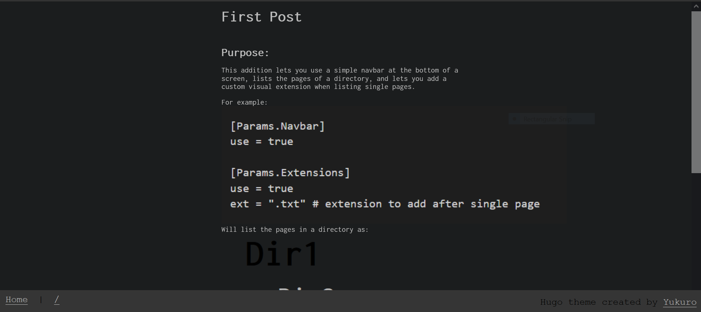
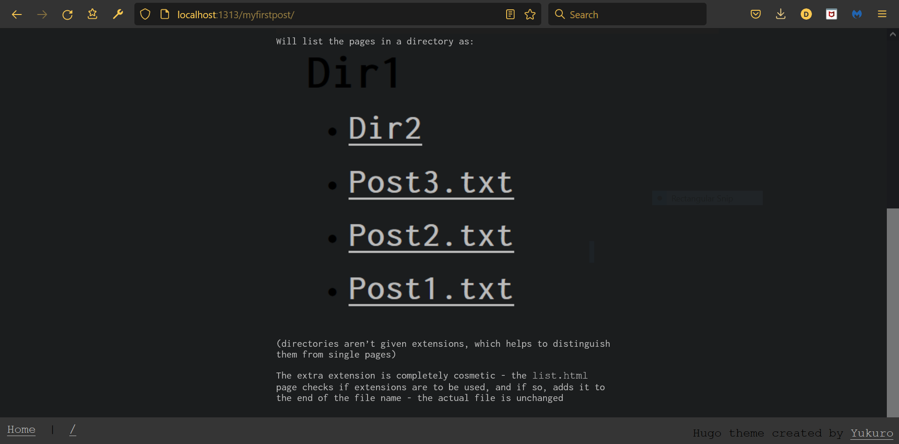
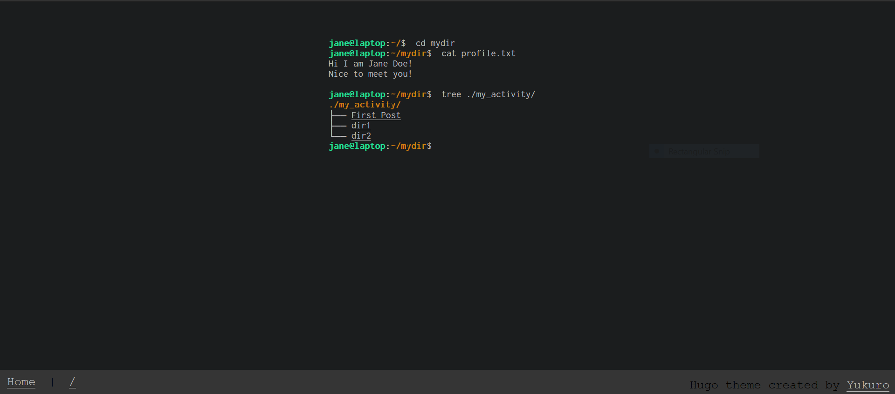
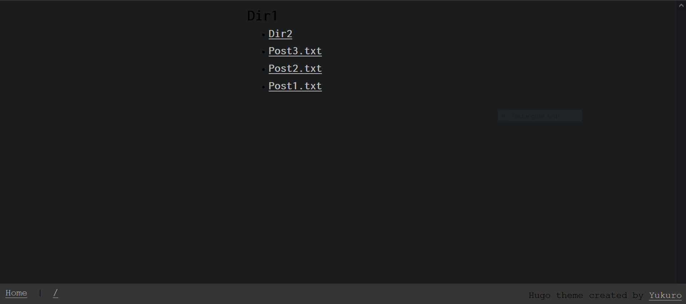
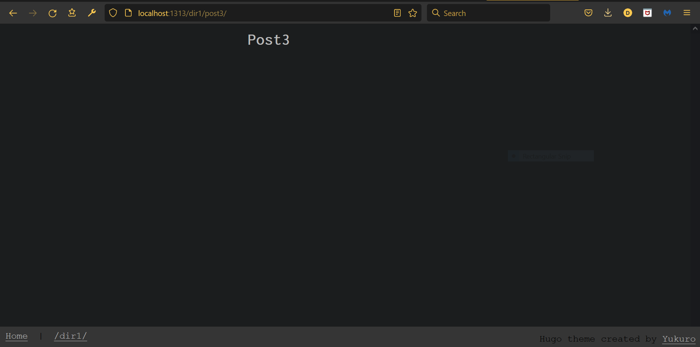

# Fork of [hugo-theme-shell](https://github.com/Yukuro/hugo-theme-shell) with a navbar at the bottom, a `list.html` page, and optional visual extensions

## Demo:
[https://n00bzunit3d.xyz/](https://n00bzunit3d.xyz/)(My ctf team's website)

___Note: Above, the "back" link text displays where you actually are(current list or single page), but this fork uses the path of the previous directory as the text instead___

## Background:
Hi! I've been using this theme for a website I'm working on and ended up making a small navbar that I thought looked pretty cool. To look a bit more "techy", I wrote Hugo code to add ".txt" to single pages(now available for any extension/general appending) and added a simple 'list.html' for general usability. I wrote some documentation, took out the hacky workarounds, and voila!

*The CHANGES file lists all the additions I made and where I made them, so aside from this directory, that should cover all of the merge differences.

## Explanation:
This fork lets you list pages, use a navbar, and add a custom visual extension to your site.
`config.toml` should have a section that reads like:
```
[Params.Navbar]
  use = true
  
[Params.Extensions]
  use = true
  ext = ".txt" # extension to add after single page
```

The `home` link in the navbar takes you to the root of the website(the `jane@laptop` page), and the link immediately after the black divider takes you to the previous directory.
  - The text for the "back" link is the path of the previous directory
  - For example: if you're at `/dir1/dir2/dir3/post.md`, the "back" button will look like this:
    [/dir1/dir2/dir3](https://www.example.org)
    and will take you to the previous directory(the directory you're in, or `dir3`)

## Visual Explanation:



## Example Images:



