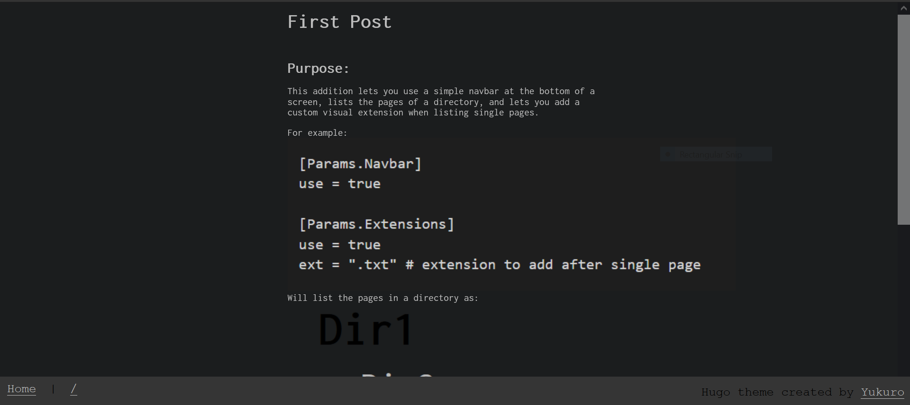
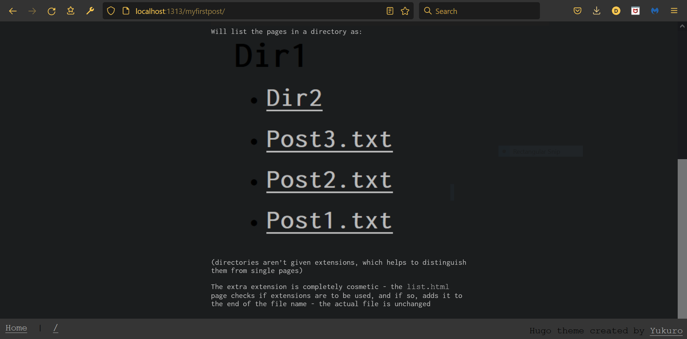
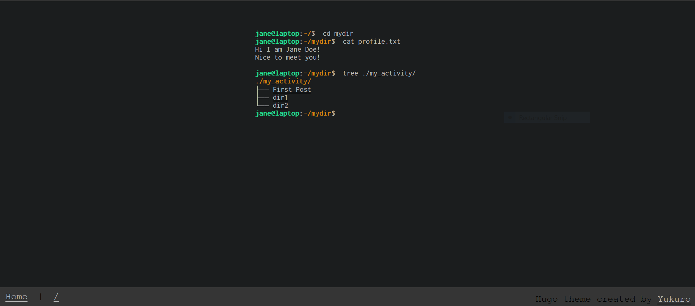
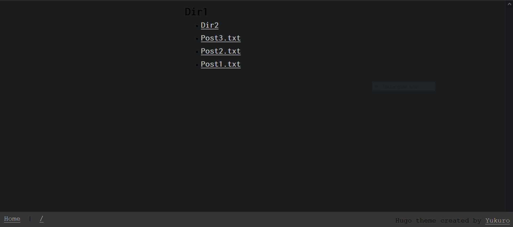
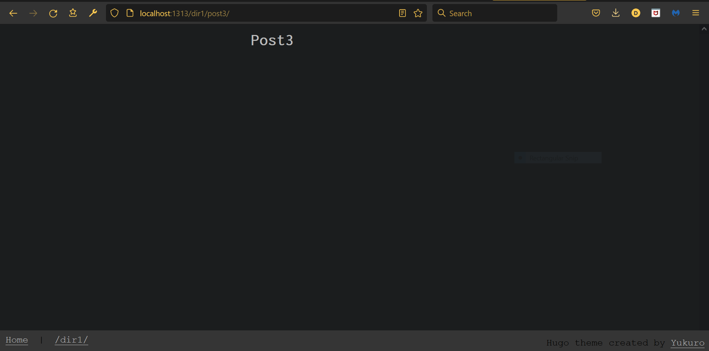

# Fork of [hugo-theme-shell](https://github.com/Yukuro/hugo-theme-shell) with a navbar at the bottom, a `list.html` page, and optional visual extensions

## Explanation:
This fork lets you list pages, use a navbar, and add a custom visual extension to your site.
`config.toml` should have a section that reads like:
``
[Params.Navbar]
  use = true
  
[Params.Extensions]
  use = true
  ext = ".txt" # extension to add after single page
``

The `home` link in the navbar takes you to the root of the website(the `jane@laptop` page), and the link immediately after the black divider takes you to the previous directory.
  - The text for the "back" link is the path of the previous directory
  - For example: if you're at `/dir1/dir2/dir3/post.md`, the "back" button will look like this:
    [/dir1/dir2/dir3](https://www.example.org)
    and will take you to the previous directory(the directory you're in, or `dir3`)

## Visual Explanation:

## Example Images:

